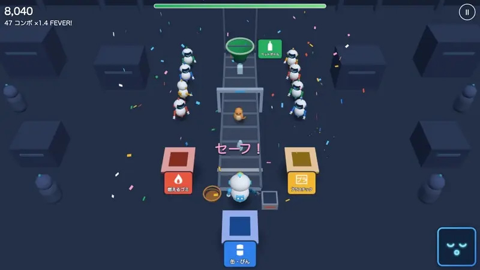
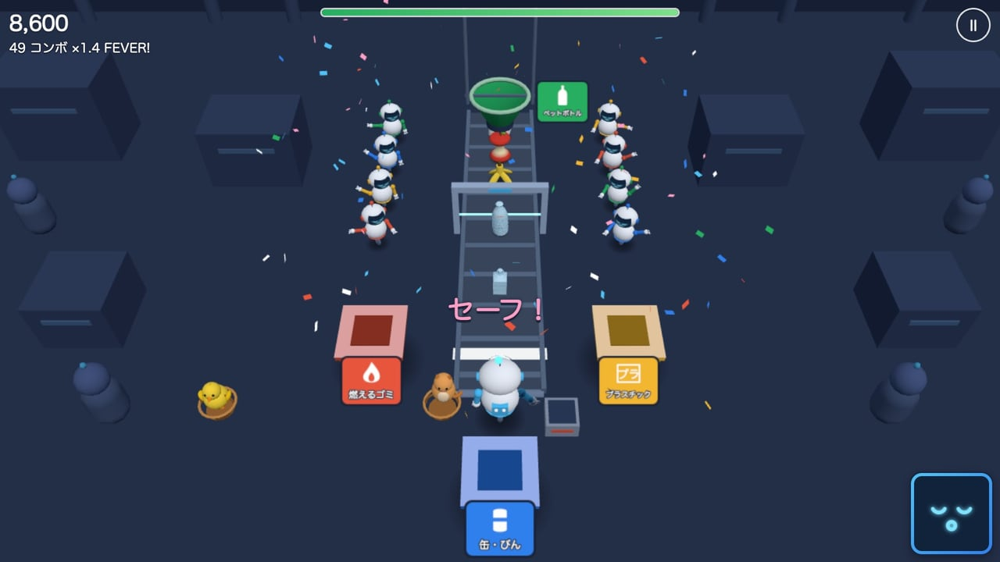
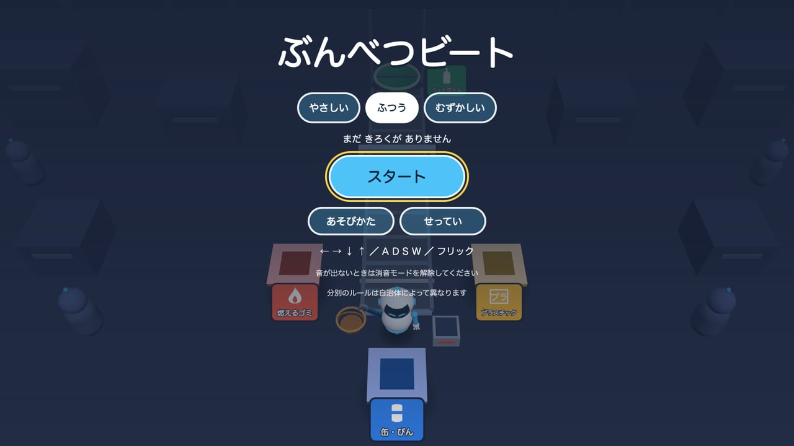
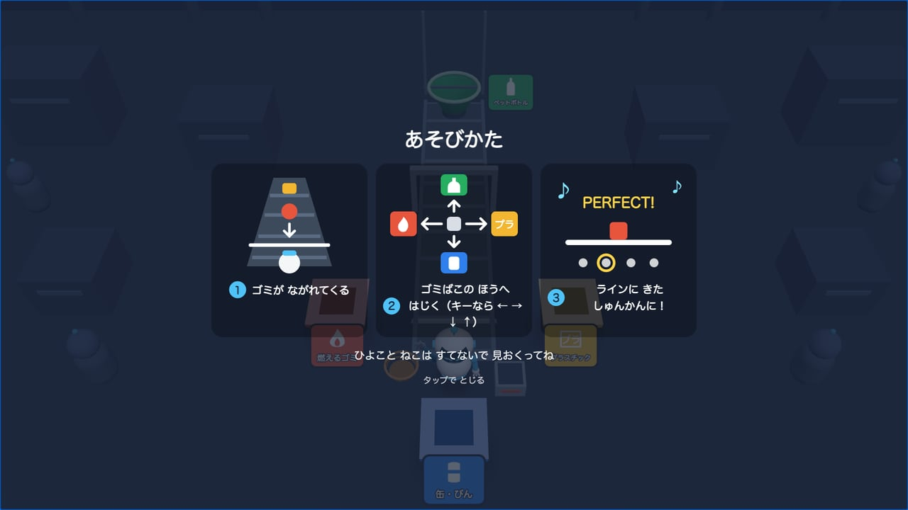
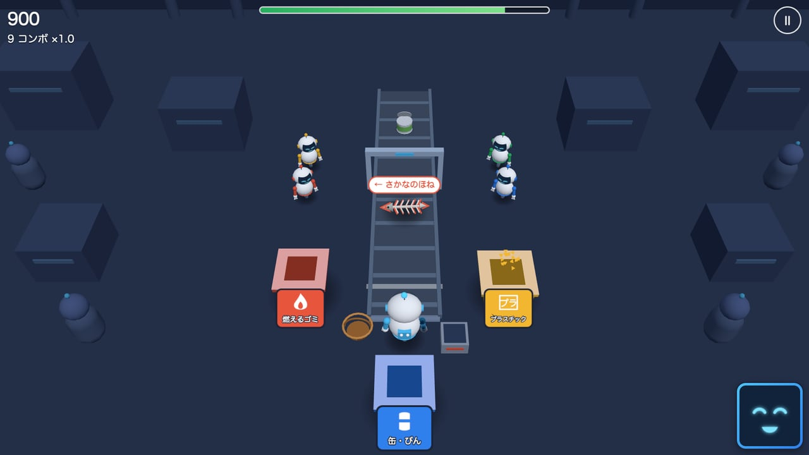
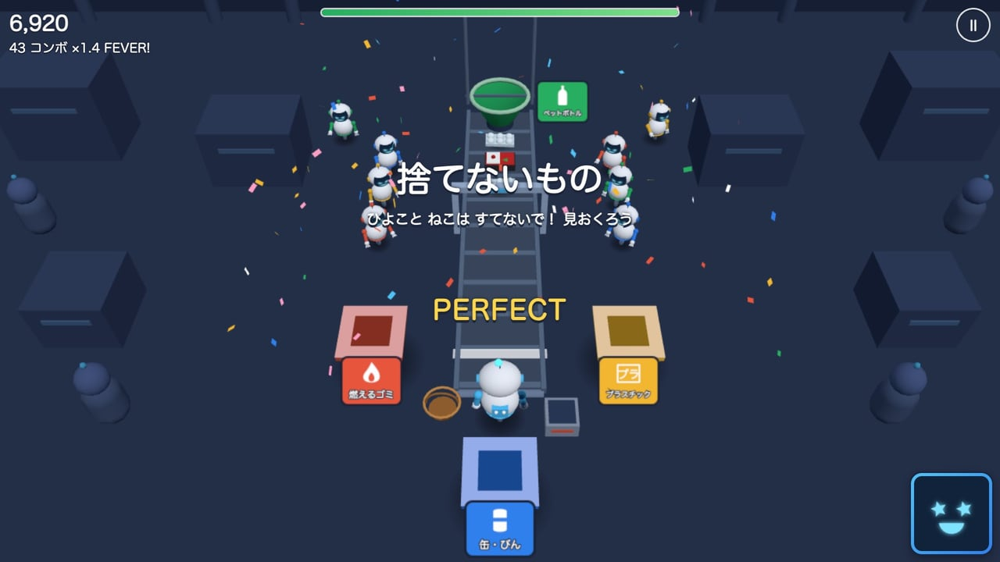
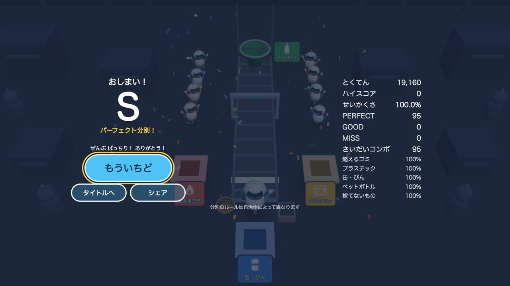
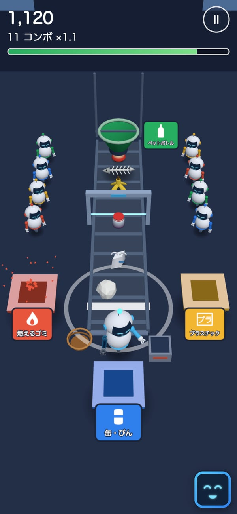
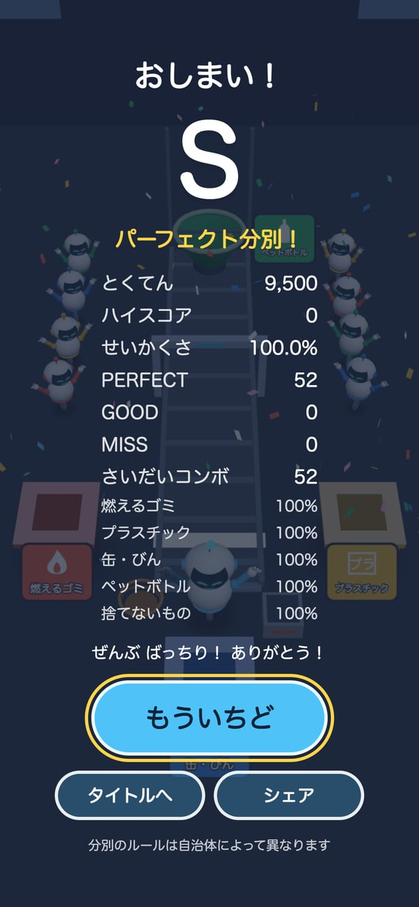

# ぶんべつビート — Bunbetsu Beat

流れてくるゴミを、音楽のリズムに合わせて 4 方向のゴミ箱へ投げ分ける、ブラウザで遊べる 3D リズムゲーム。

[](https://tanuu5.github.io/bunbetsu-beat/)
[](https://www.anthropic.com/claude)
[](./LICENSE)

<p align="center">
  
</p>

<p align="center"><b><a href="https://tanuu5.github.io/bunbetsu-beat/">▶ ブラウザで今すぐ遊ぶ</a></b>（インストール不要。キーボード・マウス・タッチで操作）</p>

**Claude Code × Claude Opus 5.5（HIGH）** で作りました。

少し未来のリサイクルセンターで、分別担当の AI ロボット「ソータ」がベルトコンベアのゴミを仕分けます。
ゴミは拍にぴったり合わせて判定位置に届くので、その瞬間に ← → ↓ ↑（スマホならフリック）でゴミ箱の方向を入れるだけ。
段階が進むとゴミ箱が増え、曲の音が重なり、見物の仲間ロボットが集まってきます。約 90 秒で 1 回遊べます。
画像・音声のファイルは使わず、3D の形も曲も効果音も、すべてコードで作っています。

## スクリーンショット

<table>
  <tr>
    <td width="50%"><br><sub>コンボ 30 でフィーバー。ひよこを見送って「セーフ！」、かごに乗って帰っていく。</sub></td>
    <td width="50%"><br><sub>タイトル。難しさは「やさしい」「ふつう」「むずかしい」の 3 つ。</sub></td>
  </tr>
  <tr>
    <td><br><sub>初めて開いたときだけ、3 枚の絵で遊び方を説明。</sub></td>
    <td><br><sub>スキャンの門を通ると、種類の色で輪郭が光る。「やさしい」では名前と矢印も出る。</sub></td>
  </tr>
  <tr>
    <td><br><sub>第 4 段階の前に予告。ひよことねこは、捨てずに見送るのが正解。</sub></td>
    <td><br><sub>結果。種類ごとの正解率と、いちばん苦手な種類へのソータのひとこと。</sub></td>
  </tr>
  <tr>
    <td><br><sub>スマホの縦持ち。コンボ 10 ごとに、判定位置から輪が広がる。</sub></td>
    <td><br><sub>最後はみんなで万歳。</sub></td>
  </tr>
</table>

画像と動画は、すべて実際の画面です。

## 遊び方

ゴミが白い判定ラインに届いた瞬間に、正しいゴミ箱の方向を入れます。

| 方向 | ゴミ箱 | 流れてくるもの（例） |
| --- | --- | --- |
| ← 左 | 燃えるゴミ（赤・炎） | バナナの皮、りんごの芯、魚の骨、紙くず |
| → 右 | プラスチック（黄・「プラ」） | 弁当の容器、レジ袋、卵のパック、お菓子の袋 |
| ↓ 下 | 缶・びん（青・缶） | ジュースの缶、缶詰の缶、ガラスのびん、ジャムのびん |
| ↑ 上 | ペットボトル（緑・ボトル） | ふたとラベルを外したペットボトル |
| 入れない | 捨てないもの | ひよこ、ねこ（見送るとセーフ） |

| 操作 | PC | スマホ・タブレット |
| --- | --- | --- |
| 捨てる | ← → ↓ ↑、または A D S W | その方向へフリック、またはゴミ箱をタップ |
| 開始・決定 | Enter / Space | ボタンをタップ |
| 一時停止 | Esc / P | 右上の Ⅱ |

- 判定は PERFECT（±60 ミリ秒）と GOOD（±130 ミリ秒）。「むずかしい」は幅が狭くなります。
- コンボ 10 ごとに得点の倍率が上がり、コンボ 30 で 8 小節のフィーバー（得点 2 倍）。
- MISS でエコゲージが減り、0 になると終わりです（「やさしい」では終わりません）。
- 段階は 4 つ。左右 → 下が加わる → 上が加わる → 捨てないものが加わる、と進みます。
- 音と画面がずれると感じたら、「せってい」の「タイミング調整」で直せます（Bluetooth のイヤホンなど）。
- 分別のルールは自治体によって異なります。ゲームの中の分け方は、この作品のための決まりです。

## 制作について

企画・ディレクション：**たぬ**　／　開発：**Claude Code（Claude Opus 5.5・推論レベル HIGH）**

仕様書（[仕様書.md](仕様書.md)）をもとに、「時間と判定の土台 → 遊びの全体 → 音 → 見た目 → 画面と仕上げ」の順に、Claude Code が実装とテストを進めました。
時間の基準は Web Audio の時計 1 つにまとめ、ゴミの位置も判定も、毎コマその時計から直接求めています。
譜面・判定・得点・フリックの処理は画面や音から切り離し、`node --test` で確かめています。
見物の仲間ロボットは、遊んで確かめる途中で出た企画者のアイデアを、仕様書に追記してから加えました。

## 更新履歴

- **2026-09-29**：公開

## 開発

ビルドはありません。ES Modules なので、ファイルを直接開かずに簡単なサーバーから開きます。

```bash
python3 -m http.server 8000
```

```bash
node --test
```

ブラウザで `http://localhost:8000/` を開きます。変更が反映されないときは、強制再読み込み（Mac なら ⌘ + Shift + R）をしてください。

確認用の URL パラメータ：

| パラメータ | 働き |
| --- | --- |
| `?seed=12345` | 譜面の種を固定する（同じ種なら同じ譜面） |
| `?debug=1` | コマ数、曲の時刻、入力のずれ（ミリ秒）、描画の命令の回数を表示する |
| `?auto=1` | 自動で完璧に入力する（最高得点は保存しない） |
| `?phase=1`〜`4` | 指定した段階から始める |
| `?mute=1` | 音を出さない（時刻の管理は動く） |
| `?nopause=1` | タブが裏に回っても一時停止しない（画面の見えない確認用） |

ファイル構成：

```
index.html / style.css
js/
├── main.js        起動、画面の切り替え、毎コマの処理
├── config.js      調整する数値のすべて
├── core/          画面にも音にも頼らない部分（テストの対象）
│   ├── rng.js  chart.js  judge.js  score.js  flick.js
├── audio/         conductor.js（曲の時刻と予約）  music.js  sfx.js  synth.js
├── view/          scene.js  robot.js  face.js  items.js  models.js  bins.js  effects.js  crowd.js  geo.js  layout.js
├── input.js  ui.js  storage.js  i18n.js
test/              chart / judge / score / flick / game のテスト
```

## GitHub Pages で公開する

ビルドがないので、リポジトリの設定の **Pages** で「Deploy from a branch」→ `main` ブランチの `/ (root)` を選ぶだけで公開できます。

## クレジット・ライセンス

- コード：MIT License（[LICENSE](LICENSE)）© 2026 たぬ
- 3D 描画：[three.js](https://threejs.org/) r180（MIT License）。リポジトリには含めず、ページから jsDelivr 経由で読み込みます。
- 画像・音声・フォントのファイルは使っていません。3D の形はコードで組み立て、曲と効果音は Web Audio API でその場で合成しています。旋律はこの作品のためのオリジナルです。文字は端末に入っている書体で表示します。
- MIT License の対象はこのリポジトリのコードと文章です。「Claude」の名前や商標の使用を許諾するものではありません。
